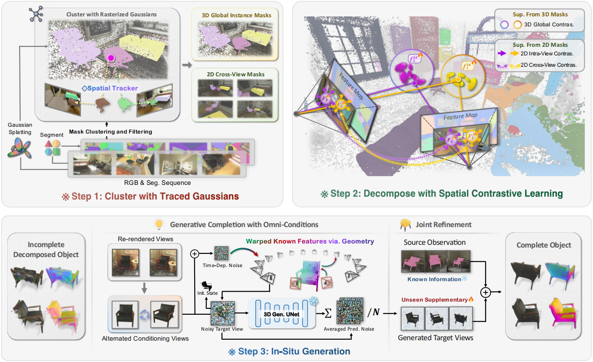

# InstaScene: Towards Complete 3D Instance Decomposition and Reconstruction from Cluttered Scenes

### [Project Page](https://zju3dv.github.io/instascene) | [Paper](https://arxiv.org/abs/2507.08416) | [Arxiv](https://arxiv.org/abs/2507.08416) | [Video](https://www.youtube.com/watch?v=PUb4l_Ttf3I)

> [InstaScene: Towards Complete 3D Instance Decomposition and Reconstruction from Cluttered Scenes](https://zju3dv.github.io/instascene),  
> Zesong Yang, Bangbang Yang, Wenqi Dong, Chenxuan Cao, Liyuan Cui, Yuewen Ma, Zhaopeng Cui, Hujun Bao  
> ICCV 2025


https://github.com/user-attachments/assets/3837634c-4ef9-4078-87ab-68a1c3e4faf9




## Todos

- [x] Release project page and paper.
- [ ] Release scene decomposition code (by the end of July).
- [ ] Release in-situ generation code.


### Citation

If you find this code useful for your research, please use the following BibTeX entry.

```
@inproceedings{yang2025instascene,
    title={InstaScene: Towards Complete 3D Instance Decomposition and Reconstruction from Cluttered Scenes},
    author={Yang, Zesong and Yang, Bangbang and Dong, Wenqi and Cao, Chenxuan and Cui, Liyuan and Ma, Yuewen and Cui, Zhaopeng and Bao, Hujun},
    booktitle=ICCV,
    year={2025}
}
```